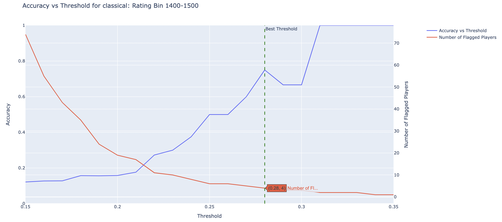

# filter-suspicious-players

This is a work-in-progress package that retrieves training data from the [lichess.org open database](https://database.lichess.org/), then trains a statistical model to detect suspicious players.

Currently the app is not functional, and has not been deployed. If cloning this repo for personal use, the structure of the python scripts assumes that there is a folder called `lichess-games-database` to which .pgn and .pgn.zst files are downloaded and unzipped (this may be automated in the future using a bash script), and that there is a folder called `lichess_player_data` to which .csv files are saved (this folder is created by `parse_pgn.py` if it doesn't exist).

### Model Description
This is a simple statistical model that flags players who have performed a certain threshold above their expected performance under the Glicko-2 rating system. The expected performance takes into account all player's complete game history and opponents in the span of the training data. The thresholds are initialized to default values, but are then adjusted separately for each 100 point rating bin in the training data.

### Model Training
We define `N` as the number of players who have performed above some threshold, and the estimated number of cheaters as `X = 0.00 * N_open + 0.75 * N_closed + 1.00 * N_violation` where `N_open` is the number of players with open accounts, `N_closed` is the number of players with closed accounts, and `N_violation` is the number of players with a terms of service violation (where `N = N_open + N_closed + N_violation`), the metric used to evaluate the performance of the threshold is the `log(N+1) * X / N`. This is a simple metric intended to reward the model for `high accuracy = X / N` in detecting suspicious players without flagging too many players (observationally, if the threshold is too low, the accuracy will decrease faster than log(N)). Note that for a threshold that is too high and flags 0 players, the metric will be 0. This metric may be fine-tuned in the future, but is sufficient for a POC.

Below is an example of the threshold vs accuracy plot below for players in the 1200-1300 range based on training data from the month of Jan 2015.



### Assumptions
The model is built on the assumption that cheating is a rare occurrence in any data set on which the model is trained. There may be unexpected behavior if the training data is composed predomininantly of players who are cheating. The model will retain its default thresholds in the event that no players have shown any significant deviations from the mean expected performance in their rating bin. 

### Sample code:
```python
import pandas as pd

from player_account_handler import PlayerAccountHandler
from model import PlayerAnomalyDetectionModel
BASE_FILE_NAME = 'lichess_db_standard_rated_2015-01'
train_data = pd.read_csv(f'lichess_player_data/{BASE_FILE_NAME}_player_features.csv')
player_account_handler = PlayerAccountHandler()
model = PlayerAnomalyDetectionModel(player_account_handler)
model.fit(train_data)
model.save_model(f'{BASE_FILE_NAME}_model')
predictions = model.predict(train_data)
```

### Unit Tests
Currently working on unit tests, which can be run with the following command:
```make test```, or if you want to run test files individually ```PYTHONPATH=. pytest tests/test_model.py```

To-do:
- write a bash script to download and unzip data from the lichess.org open database
- complete data labelling using lichess API calls, with a workaround or retry request if API rate limiting occurs 
- write unit tests for scripts that perform feature extraction and data labelling
- write unit tests for `PlayerAnomalyDetectionModel` class and methods (in-progress)